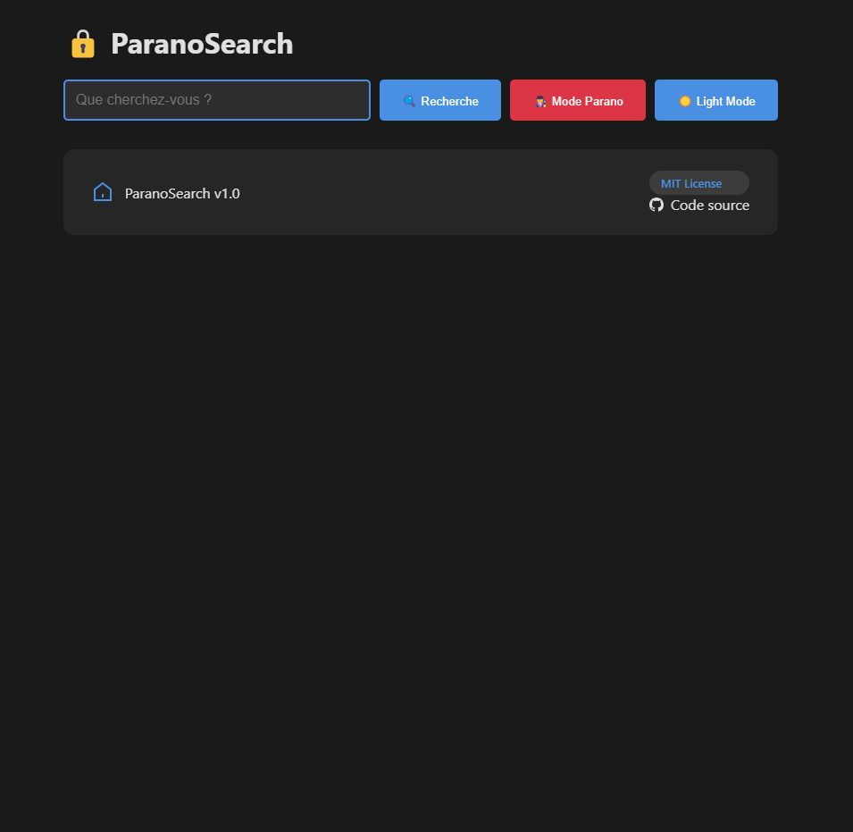
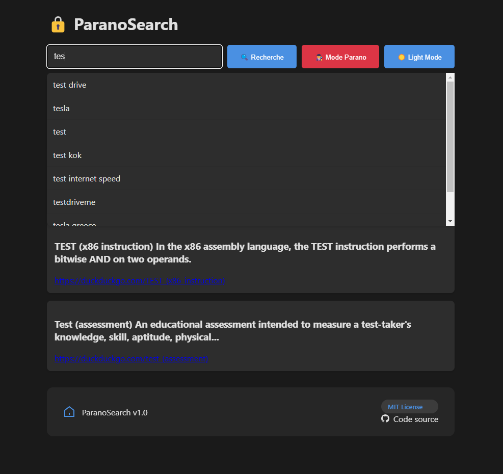

# 🔒 ParanoSearch - Moteur de recherche sécurisé

[](https://opensource.org/licenses/MIT)
[](https://github.com/whiteskyangel/ParanoSearch/releases)

Un moteur de recherche respectueux de la vie privée, avec chiffrement de bout en bout et protection anti-tracking.


## ✨ Fonctionnalités
- 🔍 **Recherche anonyme** via DuckDuckGo
- 🕵️ **Mode Parano** avec fausses requêtes aléatoires
- 🔒 **Historique chiffré** (AES-256 + Web Crypto API)
- 🌓 **Interface moderne** avec Dark Mode
- 📡 **Suggestions** en temps réel
- ⚡ **Auto-nettoyage** des résultats après 30s

## 🚀 Démarrage rapide

```bash
# Cloner le dépôt
git clone https://github.com/whiteskyangel/ParanoSearch.git
cd ParanoSearch

# Installer les dépendances
pip install -r requirements.txt

# Lancer le serveur (port 5000)
python backend.py
```

## 🖥 Prérequis
- Python 3.9+
- Navigateur moderne (Chrome 90+, Firefox 88+)

## 📸 Captures d'écran
| Mode Clair | Mode Sombre | Suggestions |
|------------|-------------|-------------|
|  |  |  |

## 🛠 Architecture
```text
ParanoSearch/
├── templates/          # Interface utilisateur
│   └── index.html
├── backend.py          # Logique serveur Flask
├── requirements.txt    # Dépendances Python
├── .gitignore          # Fichiers exclus
└── LICENSE             # Licence MIT
```

## 📄 Licence
Ce projet est distribué sous licence MIT - voir le fichier [LICENSE](LICENSE) pour plus de détails.

---

👨💻 **Développé par WhiteSkyAngel** 
